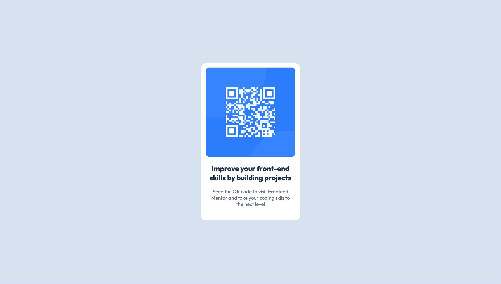

# QR_Code_Comp

First project.

# Frontend Mentor - QR code component solution

This is a solution to the [QR code component challenge on Frontend Mentor](https://www.frontendmentor.io/challenges/qr-code-component-iux_sIO_H). Frontend Mentor challenges help you improve your coding skills by building realistic projects.

## Table of contents

- [Overview](#overview)
  - [Screenshot](#screenshot)
  - [Links](#links)
- [My process](#my-process)
  - [Built with](#built-with)
  - [What I learned](#what-i-learned)
  - [Continued development](#continued-development)
  - [Useful resources](#useful-resources)
- [Author](#author)
- [Acknowledgments](#acknowledgments)

## Overview

This project was about creating a webpage that has a qr code designed to access FrontendMentor website. It is a beginner frontend project, that uses HTML and CSS.

### Screenshot



### Links

- Solution URL: [https://github.com/dma1h07ra/QR_Code_Comp]
- Live Site URL: [https://dma1h07ra.github.io/QR_Code_Comp/]

## My process

- chose the technologies required for the project: HTML and CSS
- uploaded the image to the repository
- created an HTML file: includes the qr code image, font and the backgrounds
- used CSS to style the webpage: image and text alignment and background colors

### Built with

- Semantic HTML5 markup
- CSS custom properties
- Flexbox

### What I learned

- initially, tried to host the fonts locally but eventually went with below mentioned approach:

```html
<link rel="preconnect" href="https://fonts.googleapis.com" />
<link rel="preconnect" href="https://fonts.gstatic.com" crossorigin />
<link
  href="https://fonts.googleapis.com/css2?family=Outfit:wght@100..900&display=swap"
  rel="stylesheet"
/>
```

- used flexbox to center div container after trying several methods

```css
.container {
  display: flex;
  justify-content: center;
  align-items: center;
  width: 100%;
  height: 100%;
}
```

### Continued development

- CSS was quite challenging. Will get more comfortable as I get more practice.

### Useful resources

Shoutout to mdn webdocs, chatgpt, w3schools and geeksforgeeks.

## Author

- Frontend Mentor - [@dma1h07ra](https://www.frontendmentor.io/profile/dma1h07ra)
